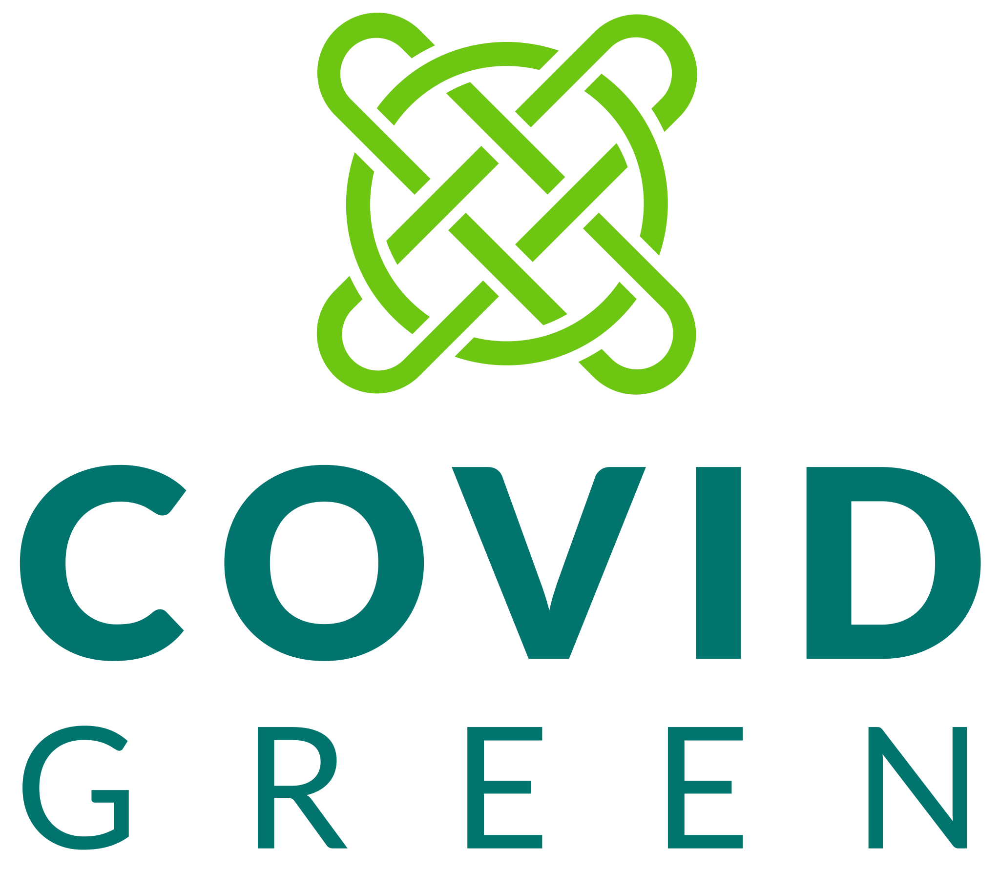
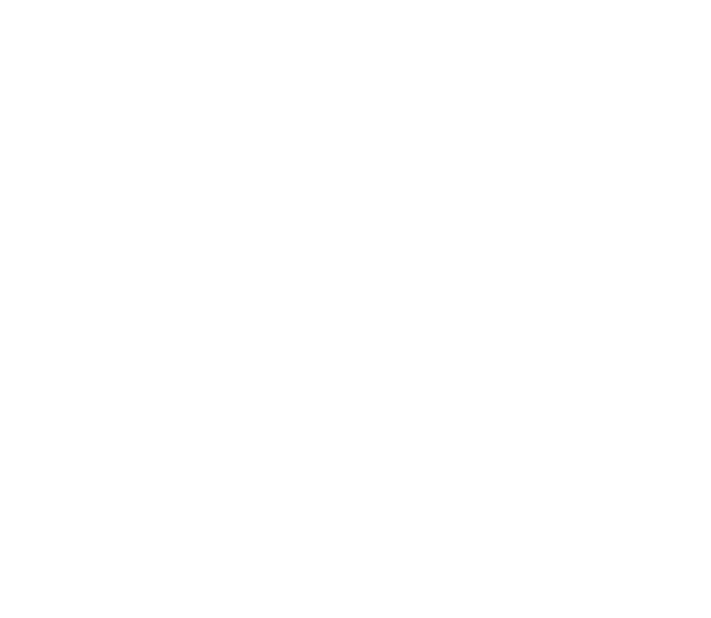
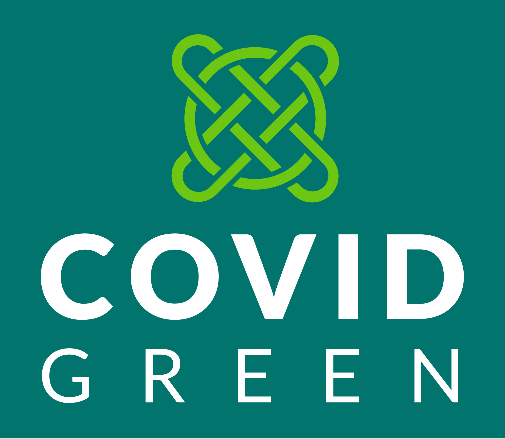
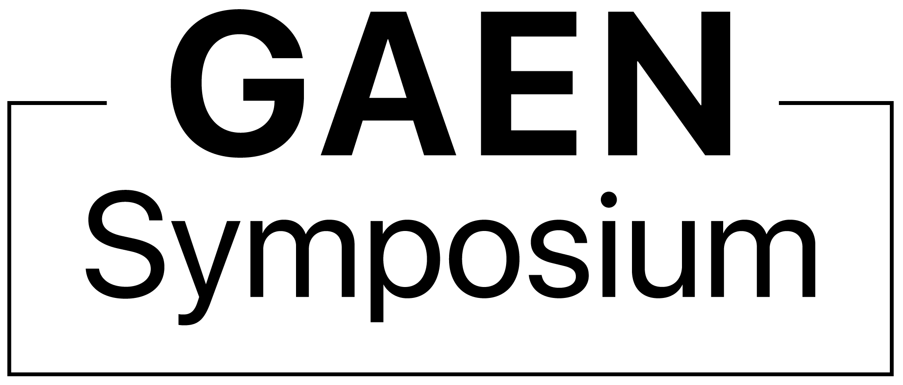

## Linux Foundation Public Health Logos

In this repo, we have artwork in standard formats for the LFPH [projects](https://www.lfph.io/join/projects/) and programs. We prepare artwork in 2 formats (PNG & SVG), 3 layouts -- horizontal (also known as landscape format), stacked (which is closer to square), and icon (which does not include the name and is square), and at least 3 versions (color/black/white). So, that's at least 18 versions of most logos.

With many browsers, you can right click and copy the logo of your choice below. Please note that although PNG is more common, SVG file sizes are smaller, supported in all modern web browsers, and a high-resolution format suitable for both print and high-resolution computer screens.

*Note: GitHub Flavored Markdown used in the Readme doesn't support background colors. The white logos below are displayed on the light grey of tables.*

#### LFPH Logos

<table>
    <tr>
    	<th colspan="7"></th>
    </tr>
    <tr>
        <th></th>
        <th colspan="3">PNG</th>
        <th colspan="3">SVG</th>
    </tr>
    <tr>
        <th></th>
        <th>horizontal</th>
        <th>stacked</th>
        <th>icon</th>
        <th>horizontal</th>
        <th>stacked</th>
        <th>icon</th>
    </tr>
    <tr>
        <th>color</th>
        <td></td>
        <td></td>
        <td></td>
        <td></td>
        <td></td>
        <td></td>
    </tr>
    <tr>
        <th>black</th>
        <td></td>
        <td></td>
        <td></td>
        <td></td>
        <td></td>
        <td></td>
    </tr>
    <tr>
        <th>white</th>
        <td></td>
        <td></td>
        <td></td>
        <td></td>
        <td></td>
        <td></td>
    </tr>

</table>

#### Covid Green Logos

<table>
    <tr>
    	<th colspan=9"></th>
    </tr>
    <tr>
        <th></th>
        <th colspan="4">PNG</th>
        <th colspan="4">SVG</th>
    </tr>
    <tr>
        <th></th>
        <th>horizontal</th>
        <th>stacked</th>
        <th>icon</th>
        <th>horizontal</th>
        <th>stacked</th>
        <th>icon</th>
    </tr>
    <tr>
        <th>color</th>
        <td></td>
        <td></td>
        <td></td>
        <td></td>
        <td></td>
        <td></td>
    </tr>
    <tr>
        <th>black</th>
        <td></td>
        <td></td>
        <td></td>
        <td></td>
        <td></td>
        <td></td>
    </tr>
    <tr>
        <th>white</th>
        <td></td>
        <td></td>
        <td></td>
        <td></td>
        <td></td>
        <td></td>
    </tr>
	<tr>
        <th>reversed color</th>
        <td></td>
        <td></td>
        <td></td>
        <td></td>
        <td></td>
        <td></td>
    </tr>
</table>

#### Covid Shield Logos

<table>
    <tr>
    	<th colspan="7"></th>
    </tr>
    <tr>
        <th></th>
        <th colspan="3">PNG</th>
        <th colspan="3">SVG</th>
    </tr>
    <tr>
        <th></th>
        <th>horizontal</th>
        <th>stacked</th>
        <th>icon</th>
        <th>horizontal</th>
        <th>stacked</th>
        <th>icon</th>
    </tr>
    <tr>
        <th>color</th>
        <td></td>
        <td></td>
        <td></td>
        <td></td>
        <td></td>
        <td></td>
    </tr>
    <tr>
        <th>black</th>
        <td></td>
        <td></td>
        <td></td>
        <td></td>
        <td></td>
        <td></td>
    </tr>
    <tr>
        <th>white</th>
        <td></td>
        <td></td>
        <td></td>
        <td></td>
        <td></td>
        <td></td>
    </tr>
</table>

#### Herald Logos

<table>
    <tr>
    	<th colspan="7"></th>
    </tr>
    <tr>
        <th></th>
        <th colspan="3">PNG</th>
        <th colspan="3">SVG</th>
    </tr>
    <tr>
        <th></th>
        <th>horizontal</th>
        <th>stacked</th>
        <th>icon</th>
        <th>horizontal</th>
        <th>stacked</th>
        <th>icon</th>
    </tr>
    <tr style="background-color: lightgray">
        <th style="color:black;">light</th>
        <td></td>
        <td></td>
        <td style="color:black;">N/A use below</td>
        <td></td>
        <td></td>
        <td style="color:black;">N/A</td>
    </tr>
    <tr style="background-color: white">
        <th style="color:black;">dark</th>
        <td></td>
        <td></td>
        <td></td>
        <td></td>
        <td></td>
        <td style="color:black;">N/A</td>
    </tr>
</table>

Note: Herald logos also available alongside the above in EPS format.

#### LFPH Landscape Logos

<table>
    <tr>
    	<th colspan="4"></th>
    </tr>
    <tr>
        <th colspan="2">PNG</th>
        <th colspan="2">SVG</th>
    </tr>
    <tr>
        <th colspan="1">horizontal</th>
        <th colspan="1">icon</th>
        <th colspan="1">horizontal</th>
        <th colspan="1">icon</th>
    </tr>
    <tr>
        <td></td>
        <td></td>    
        <td></td>
        <td></td>    
    </tr>
</table>

#### GAEN Symposium Logos

<table>
    <tr>
    	<th colspan="4"></th>
    </tr>
    <tr>
        <th colspan="2">PNG</th>
        <th colspan="2">SVG</th>
    </tr>
    <tr>
        <th colspan="1">stacked</th>
        <th colspan="1">icon</th>
        <th colspan="1">stacked</th>
        <th colspan="1">icon</th>
    </tr>
    <tr>
        <td></td>
        <td></td>    
        <td></td>
        <td></td>    
    </tr>
</table>
 

Use of any trademark or logo is subject to the trademark policy available at https://www.linuxfoundation.org/trademark-usage

Questions? Please email [info@lfph.io](mailto:info@lfph.io).
